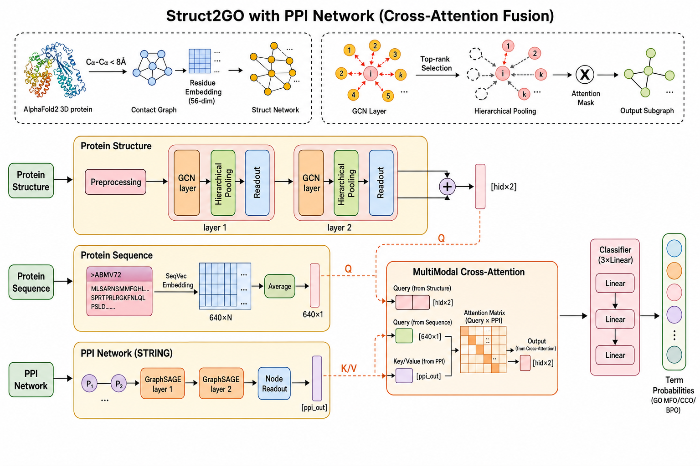

# ESM-AlphaFold-GO

Mô hình dự đoán chức năng protein (Gene Ontology) kết hợp **3 nguồn thông tin**:

| Nhánh | Dữ liệu đầu vào | Mạng xử lý |
|---|---|---|
| Cấu trúc protein | Contact map từ AlphaFold2 PDB | GCN + SAGPool (Hierarchical) |
| Trình tự protein | `seq.fasta` → ESM-2 / SeqVec 640-dim | Average pooling |
| Mạng tương tác PPI | `ppi.txt` (STRING) → GraphSAGE | PPIEncoder (2 lớp) + **Cross-Attention** fusion |

Đầu ra: xác suất cho từng GO term thuộc 3 nhánh **MFO** (308 term), **CCO** (310 term), **BPO** (713 term).

---

## Mục lục

1. [Cấu trúc thư mục và dữ liệu](#1-cấu-trúc-thư-mục-và-dữ-liệu)
2. [Cài đặt môi trường](#2-cài-đặt-môi-trường)
3. [Pipeline xử lý dữ liệu — chi tiết từng script](#3-pipeline-xử-lý-dữ-liệu--chi-tiết-từng-script)
4. [Huấn luyện (local & Kaggle)](#4-huấn-luyện-local--kaggle)
   - [4.5 Chống rò rỉ dữ liệu qua PPI (PPI leakage guard)](#45-chống-rò-rỉ-dữ-liệu-qua-ppi-ppi-leakage-guard)
   - [4.6 Loss ablation: bce / bce_pos_weight / focal](#46-loss-ablation-bce--bce_pos_weight--focal)
5. [Đánh giá](#5-đánh-giá)
6. [Kiến trúc model](#6-kiến-trúc-model)
7. [Xử lý sự cố](#7-xử-lý-sự-cố)
8. [Huấn luyện trên Kaggle T4 (chi tiết)](#8-huấn-luyện-trên-kaggle-t4-chi-tiết)

---

> **Chỉ muốn biết chạy cái gì, theo thứ tự nào?** → [RUNBOOK.md](RUNBOOK.md).
> File README này giải thích *vì sao*; RUNBOOK là thứ tự thao tác kèm output mong đợi
> ở từng bước.

## 1. Cấu trúc thư mục và dữ liệu

### Đường dẫn: `DATA_DIR` và `RAW_DIR`

Tài liệu này viết theo máy Windows gốc (`D:\CAFA6`, `D:\raw_data`), nhưng **script
không còn hardcode 2 đường dẫn đó**. `data_processing/paths.py` giải quyết theo thứ tự:

1. Biến môi trường `DATA_DIR` / `RAW_DIR`
2. Thư mục repo (`<repo>/proceed_data`, `<repo>/../raw_data`)
3. Thư mục làm việc hiện tại
4. `D:/CAFA6`, `D:/raw_data` — **chỉ khi đang chạy Windows**

Nên trên Linux/macOS/Kaggle, để repo cạnh `raw_data/` là chạy được luôn:

```
_4study/
├── CAFA6/            ← repo (chính là DATA_DIR: chứa proceed_data/, divided_data/)
└── raw_data/         ← RAW_DIR: ppi.txt, seq.fasta, goa_human.gaf.gz, struct_feature/
```

Đặt khác chỗ thì khai báo rõ:

```bash
export DATA_DIR=/duong/dan/CAFA6
export RAW_DIR=/duong/dan/raw_data
```

Kiểm tra script đang trỏ vào đâu: `python scripts/check_env.py` (mục 4 in ra
`raw_dir` và `data_dir` thật sự đang dùng).

### Dữ liệu thô (cần có sẵn trước khi chạy)

```
D:\raw_data\
├── struct_feature\                          ← Thư mục chứa file cấu trúc AlphaFold2
│   ├── AF-A0A0A0MRZ7-F1-model_v6.pdb.gz   ← File PDB nén (dùng để xây contact map)
│   ├── AF-A0A0A0MRZ7-F1-model_v6.cif.gz   ← File CIF nén (không dùng trong pipeline)
│   ├── AF-A0A0A0MRZ8-F1-model_v6.pdb.gz
│   └── ...  (mỗi protein có 1 cặp .pdb.gz + .cif.gz)
│
├── goa_human.gaf.gz    ← GO annotation của human proteome (từ UniProt GOA)
├── ppi.txt             ← PPI network (định dạng STRING: protein1 protein2 score)
└── seq.fasta           ← Trình tự protein (định dạng FASTA, UniProt ID)
```

> **Tên file PDB:** Pattern `AF-{UniProtID}-F1-model_v6.pdb.gz`.
> Script lấy UniProtID bằng cách tách `-` tại vị trí thứ 2: `filename.split('-')[1]`.

### Thư mục dự án

```
D:\CAFA6\
├── data_processing\
│   ├── 1_get_valid_ids.py              ← Bước 1: lấy danh sách protein ID hợp lệ
│   ├── go_anno.py                      ← Bước 2: parse GO annotation → JSON
│   ├── split_protein_ids.py            ← Bước 2b: chia train/valid/test SỚM (chống leak)
│   ├── split_utils.py                  ← Hàm chia split dùng chung (không tự chạy)
│   ├── 2_extract_struct_map.py         ← Bước 3: PDB.gz → contact map edge list  ✓ DÙNG CÁI NÀY
│   ├── predicted_protein_struct2map.py ← (script cũ, path Linux, không dùng)
│   ├── get_sequence.py                 ← Bước 4a: PDB → one-hot sequence (26-dim)
│   ├── seq2vec.py                      ← Bước 4b: FASTA → SeqVec embedding (1024-dim)
│   ├── read_seqvec_features.py         ← Bước 4c: chuẩn hóa SeqVec → dict pickle
│   ├── 3_uniprot_mapping.py            ← Bước 5: ENSP ID trong ppi.txt → UniProtKB AC
│   ├── 4_build_ppi_graph.py            ← Bước 6: xây PPI global DGL graph + ppi_graph_train_{ns}
│   ├── 3_build_graph_dataset.py        ← Bước 7: ghép tất cả → dataset pickle (label_network chỉ từ train)
│   ├── divide_data.py                  ← Bước 8: chia train/valid/test (đọc lại split_{ns}.json)
│   └── sort.py                         ← (tiện ích sắp xếp edge file, dùng nếu cần)
│
├── model\
│   ├── network.py    ← SAGNetworkHierarchical + PPIEncoder
│   ├── layer.py      ← ConvPoolBlock, SAGPool
│   ├── evaluation.py ← calculate_performance, cacul_aupr
│   └── utils.py
│
├── train_Struct2GO2.py   ← Script huấn luyện chính (--kaggle cho T4)
├── eval_Struct2GO2.py    ← Script đánh giá / xuất kết quả
├── pack_for_kaggle.py    ← Đóng gói dataset upload Kaggle
├── kaggle_notebook.md    ← Template notebook Kaggle (copy từng cell)
├── model.png             ← Sơ đồ kiến trúc gốc (2 nhánh)
├── model_with_ppi.png    ← Sơ đồ đầy đủ (3 nhánh + Cross-Attention)
│
├── proceed_data\         ← Dữ liệu đã xử lý (tự động tạo)
├── divided_data\         ← Dataset chia train/valid/test (tự động tạo)
├── save_models\          ← Model checkpoint (tự động tạo)
├── log\                  ← Training log (tự động tạo)
└── test_result\          ← Kết quả đánh giá (tự động tạo)
```

### Sơ đồ luồng dữ liệu tổng quan

```
D:\raw_data\struct_feature\*.pdb.gz
    │ Bước 1                    │ Bước 3
    ▼                           ▼
proceed_data\             proceed_data\
valid_protein_ids.csv     proteins_edges\{ID}.txt  (contact map edges)
                                    │
D:\raw_data\goa_human.gaf.gz        │
    │ Bước 2                        │
    ▼                               │
proceed_data\human_{BP/MF/CC}_ACS.json
    │ Bước 2b (SỚM — chống leak)     │
    ▼                               │
proceed_data\split_{bp/mf/cc}.json  │  ({"train":[...], "valid":[...], "test":[...]})
    │                               │
D:\raw_data\seq.fasta               │
    │ Bước 4                        │
    ▼                               │
proceed_data\dict_sequence_feature  │  (SeqVec 1024-dim)
proceed_data\protein_node2onehot    │  (one-hot 26-dim per residue)
                                    │
D:\raw_data\ppi.txt                 │
    │ Bước 5                        │
    ▼                               │
proceed_data\uniprot_ensembl_mapping.csv
    │ Bước 6 (đọc split_{ns}.json)   │
    ▼                               │
proceed_data\ppi_graph_global  ◄────┤
proceed_data\ppi_protein_index      │
proceed_data\ppi_graph_train_{ns}   │  (đã ẩn cạnh valid/test — dùng khi train)
                                    │ Bước 7 (đọc split_{ns}.json cho label_network)
                                    ▼
                    proceed_data\emb_graph_{ns}
                    proceed_data\emb_seq_feature_{ns}
                    proceed_data\emb_label_{ns}
                    proceed_data\emb_ppi_node_id_{ns}
                    proceed_data\label_{ns}_network      (chỉ tính từ protein train)
                                    │ Bước 8 (đọc lại split_{ns}.json, giao với emb_graph)
                                    ▼
                    divided_data\{ns}_{train/valid/test}_dataset
                                    │
                             Train  ▼  Eval
                    save_models\bestmodel_*.pkl
```

---

## 2. Cài đặt môi trường

### Yêu cầu hệ thống

- Python 3.10+
- CUDA GPU (khuyến nghị; CPU chạy được nhưng rất chậm)
- RAM ≥ 32 GB

### Tạo môi trường conda

```bash
conda env create -f environment.yml
conda activate cafa6
```

### Hoặc cài thủ công qua pip

```bash
pip install torch torchvision torchaudio --index-url https://download.pytorch.org/whl/cu118
pip install dgl -f https://data.dgl.ai/wheels/cu118/repo.html
pip install biopython scipy scikit-learn transformers tqdm pandas requests
```

### Kiểm tra

```python
import torch, dgl
print(torch.__version__)          # >= 2.0
print(dgl.__version__)            # >= 1.1
print(torch.cuda.is_available())  # True nếu có GPU
```

---

## 3. Pipeline xử lý dữ liệu — chi tiết từng script

Chạy **đúng thứ tự** từ Bước 1 đến Bước 8. Tạo thư mục output trước:

```bash
mkdir D:\CAFA6\proceed_data
mkdir D:\CAFA6\divided_data
mkdir D:\CAFA6\save_models
mkdir D:\CAFA6\log
mkdir D:\CAFA6\test_result
```

### Checklist nhanh (theo thứ tự)

| Bước | Script | Output chính | Thời gian ước tính |
|:---:|---|---|:---:|
| 1 | `1_get_valid_ids.py` | `valid_protein_ids.csv` | vài phút |
| 2 | `go_anno.py` | `HUMAN_protein_info.json` | 5–15 phút |
| **2b** | **`split_protein_ids.py`** | **`split_{bp,mf,cc}.json`, `label_vocab_{bp,mf,cc}.json`** | **vài giây** |
| 3 | `2_extract_struct_map.py` | `proteins_edges/*.txt` | vài giờ (tùy số PDB) |
| 4a | `get_sequence.py` | `protein_node2onehot` | vài giờ |
| 4b | `seq2vec.py` hoặc ESM-2 | `9606-avg-emb.pkl` | vài giờ |
| 4c | `read_seqvec_features.py` | `dict_sequence_feature` | vài phút |
| 5 | `3_uniprot_mapping.py` | `uniprot_ensembl_mapping.csv` | 10–30 phút |
| 6 | `4_build_ppi_graph.py` | `ppi_graph_global`, `ppi_protein_index`, `ppi_graph_train_*` | 5–20 phút |
| 7 | `3_build_graph_dataset.py` | `emb_graph_*`, `emb_seq_feature_*`, `label_*_network` (chỉ từ train), … | 30–90 phút |
| 8 | `divide_data.py` | `divided_data/*_dataset` (đọc lại `split_{ns}.json`) | vài phút |
| **audit** | **`scripts/audit_data.py`** | **kiểm tra data trước khi train/pack** ([mục 7](#7-xử-lý-sự-cố)) | **vài giây** |
| — | `pack_for_kaggle.py` (nếu lên Kaggle) | `kaggle_data.zip` | vài phút |
| Train | `train_Struct2GO2.py` | `save_models/bestmodel_*.pkl` | xem mục 4 / 8 |

> **Bước 2b bắt buộc phải chạy TRƯỚC bước 6 và 7** để 2 bước đó build được
> `ppi_graph_train_*` và `label_*_network` "sạch" (chỉ từ train) — nếu bỏ qua,
> pipeline vẫn chạy được nhưng rơi về hành vi cũ (tính từ toàn bộ dữ liệu, có
> cảnh báo `[WARN]` in ra) và `train_Struct2GO2.py` sẽ phải tự mask PPI lúc
> runtime (chậm hơn). Xem [mục 4.5](#45-chống-rò-rỉ-dữ-liệu-qua-ppi-ppi-leakage-guard).

---

### Bước 1 — Trích xuất danh sách protein ID hợp lệ

**Script:** `data_processing/1_get_valid_ids.py`

**Làm gì:** Quét toàn bộ file `*.pdb.gz` trong `D:\raw_data\struct_feature\`, trích xuất UniProt ID từ tên file theo pattern `AF-{UniProtID}-F1-model_v6.pdb.gz`, lưu danh sách ra CSV.

**Input:**
```
D:\raw_data\struct_feature\AF-*.pdb.gz
```

**Output:**
```
D:\CAFA6\proceed_data\valid_protein_ids.csv
    Protein_ID
    A0A0A0MRZ7
    A0A0A0MRZ8
    ...
```

**Chạy:**
```bash
cd D:\CAFA6
python data_processing/1_get_valid_ids.py
```

---

### Bước 2 — Parse GO annotation

**Script:** `data_processing/go_anno.py`

**Làm gì:** Đọc file `goa_human.gaf.gz`, parse từng dòng annotation (bỏ qua dòng comment bắt đầu bằng `!`), nhóm GO term theo protein ID (cột 2 = UniProt ID, cột 5 = GO term).

**⚠️ Sửa path trước khi chạy** — script hiện đọc từ `D:/CAFA6/goa_human.gaf.gz` nhưng file thực tế ở `D:/raw_data/`. Mở `go_anno.py` sửa dòng 4:

```python
# Sửa từ:
with gzip.open("D:/CAFA6/goa_human.gaf.gz", "rt") as f:
# Thành:
with gzip.open("D:/raw_data/goa_human.gaf.gz", "rt") as f:
```

**Input:**
```
D:\raw_data\goa_human.gaf.gz
```

**Output:**
```
D:\CAFA6\proceed_data\HUMAN_protein_info.json
    {"P12345": ["GO:0005515", "GO:0003677", ...], ...}
```

> **Lưu ý:** Output này chứa toàn bộ annotation chưa lọc theo nhánh. Bước 7 cần các file `human_BP_ACS.json`, `human_MF_ACS.json`, `human_CC_ACS.json` đã lọc theo nhánh GO và ngưỡng tần suất (loại bỏ GO term xuất hiện < N protein). Các file này cần được tạo từ `HUMAN_protein_info.json` kết hợp với `go.obo`.

**Chạy:**
```bash
python data_processing/go_anno.py
```

---

### Bước 2b — Chia train/valid/test theo protein ID (SỚM — chống leak)

**Script:** `data_processing/split_protein_ids.py`

**Vì sao đặt ở đây, không để cuối như bước 8 (pipeline cũ):** bước 6
(`4_build_ppi_graph.py`) và bước 7 (`3_build_graph_dataset.py`) tính ra 2
artifact — `ppi_graph_global` và `label_{ns}_network` — mà nếu chạy TRƯỚC khi
biết protein nào thuộc train/valid/test thì buộc phải dùng TOÀN BỘ dữ liệu,
gây rò rỉ gián tiếp thống kê valid/test vào lúc train (xem
[mục 4.5](#45-chống-rò-rỉ-dữ-liệu-qua-ppi-ppi-leakage-guard)). Chạy bước này
sớm để bước 6/7 có thể tự lọc "chỉ tính từ train".

**Làm gì:** Với mỗi nhánh GO (bp/mf/cc):
1. Đọc danh sách protein có annotation (`human_{NS}_ACS.json`), chia ngẫu nhiên
   70/20/10 (seed cố định, mặc định 42) thành train/valid/test, lưu ra 1 file JSON nhỏ.
2. Tính **`label_vocab_{ns}.json`** — danh sách GO term được coi là nhãn hợp lệ,
   lọc theo tần suất tối thiểu (`--min-bp 250`, `--min-other 100`, khớp mặc định
   `2_build_go_namespace.py`) nhưng **CHỈ ĐẾM TRÊN PROTEIN TRAIN** vừa chia ở bước 1.

**Vì sao bước 2 quan trọng (bug đã sửa):** trước đây `2_build_go_namespace.py` có
tính bộ lọc min-count này, nhưng `3_build_graph_dataset.py` lại **rebuild vocab
từ đầu không lọc** rồi ghi đè lên — bộ lọc coi như vô hiệu, khiến cả GO term chỉ
xuất hiện ở **1 protein duy nhất** cũng thành 1 nhãn model phải học (mất cân bằng
cực đoan, gây khó hội tụ và F-max thấp giả tạo). Giờ `3_build_graph_dataset.py`
đọc thẳng `label_vocab_{ns}.json` do bước này sinh ra làm vocab chính thức. Đếm
tần suất trên train (không phải toàn bộ) để không lặp lại kiểu leak giống
`label_{ns}_network` — GO term chỉ xuất hiện ở valid/test (không có trong train)
bị loại tự nhiên, hợp lý vì model không có tín hiệu train nào cho nhãn đó.

**Input:**
```
D:\CAFA6\proceed_data\human_BP_ACS.json
D:\CAFA6\proceed_data\human_MF_ACS.json
D:\CAFA6\proceed_data\human_CC_ACS.json
```

**Output:**
```
D:\CAFA6\proceed_data\split_bp.json
D:\CAFA6\proceed_data\split_mf.json
D:\CAFA6\proceed_data\split_cc.json
    {
      "seed": 42, "train_ratio": 0.7, "valid_ratio": 0.2,
      "train": ["A0A0A0MRZ7", ...], "valid": [...], "test": [...]
    }

D:\CAFA6\proceed_data\label_vocab_bp.json
D:\CAFA6\proceed_data\label_vocab_mf.json
D:\CAFA6\proceed_data\label_vocab_cc.json
    ["GO:0000001", ...]   ← đã lọc min-count, đếm trên train
```

**Chạy:**
```bash
python data_processing/split_protein_ids.py
# Đổi ngưỡng min-count nếu cần (vd. dữ liệu ít, ngưỡng mặc định lọc quá tay):
python data_processing/split_protein_ids.py --min-bp 100 --min-other 50 --force
```

> **Lưu ý:** đây là split trên tập "protein có GO annotation" — TẬP LỚN HƠN
> tập protein cuối cùng thực sự có đủ dữ liệu (`emb_graph_{ns}`, sau khi bước
> 3/7 lọc bỏ protein thiếu contact map). Bước 8 (`divide_data.py`) sẽ tự **giao**
> (intersect) split này với `emb_graph_{ns}.keys()` để ra dataset cuối cùng —
> 1 protein bị bỏ vì thiếu contact map thì bỏ ở cả 3 tập, không đổi nhóm
> train/valid/test của các protein còn lại.
>
> **`--seed` phải khớp** giữa `split_protein_ids.py` và `divide_data.py` nếu
> Dương từng đổi seed thủ công — mặc định cả 2 đều là `42` nên không cần làm
> gì thêm trong trường hợp thông thường.
>
> **Migration:** nếu đã build `proceed_data`/`divided_data` TRƯỚC khi có fix này
> (vocab không lọc, `num_labels` lớn hơn), phải chạy lại từ bước 2b → 6 → 7 → 8
> (`--force`) rồi **train lại** — checkpoint cũ có `out_dim`/`num_labels` khác,
> không load được vào model mới và số liệu F-max không so sánh 1:1 được.
>
> **Cảnh báo mất cân bằng do split:** script còn tự in `[WARN]` nếu có GO term
> trong `label_vocab_{ns}.json` **không có positive nào** ở valid hoặc test —
> hệ quả của random split thuần theo protein ID (không stratify theo nhãn).
> Chỉ là cảnh báo (không tự đổi split); nếu thấy nhiều label bị vậy, cân nhắc
> tăng `--min-bp`/`--min-other` (bớt label hiếm) hoặc đổi seed thử lại.

---

### Đang có DATA CŨ (build theo pipeline trên `main`, chưa có Bước 2b)?

Data cũ **vẫn chạy được** với code mới (các đường fallback tự kích hoạt kèm
`[WARN]`), nhưng còn 3 vấn đề. Có 3 cách xử lý:

| | **A. Migrate nhanh** | **A+. Migrate + `--relabel`** | **B. Build lại** (Bước 2b → 6 → 7 → 8) |
|---|---|---|---|
| Lệnh | `migrate_old_data.py` | `migrate_old_data.py --relabel` | Bước 2b → 6 → 7 → 8 |
| Thời gian | ~vài phút | ~10–30 phút / nhánh | ~1–2 giờ |
| Cần gì | Chỉ cần bản pack cũ (kể cả trên Kaggle) | Bản pack cũ + `divided_data` **ghi được** + chỗ trống ≈ file dataset lớn nhất | `proceed_data` đầy đủ ở **máy local** (`proteins_edges/`, `dict_sequence_feature`, …) |
| `divided_data` | Giữ nguyên | Giữ nguyên split, **ghi đè `ds.label`** | Build lại toàn bộ |
| Sửa PPI leak (build-time `ppi_graph_train_*`) | ✅ | ✅ | ✅ |
| Sửa leak `label_{ns}_network` (chỉ từ train) | ✅ | ✅ | ✅ |
| Sửa vocab min-count (mất cân bằng, MF 5136 label) | ❌ | ✅ | ✅ |
| Checkpoint cũ | Vẫn load được | **Không** (`num_labels` đổi) | **Không** (`num_labels` đổi) |

**Cách A — migrate nhanh:**

```bash
python scripts/migrate_old_data.py --dry-run   # xem trước, không ghi gì
python scripts/migrate_old_data.py             # chạy thật
python scripts/audit_data.py                   # kiểm tra lại

# Trên Kaggle (proceed_data là symlink read-only -> cần --materialize):
DATA_DIR=/kaggle/working/CAFA6 python scripts/migrate_old_data.py --materialize
```

Script suy ra `split_{ns}.json` **từ chính `divided_data` đang có** (giữ đúng
phân vùng cũ, không chia lại), rồi dựng `ppi_graph_train_{ns}` và dựng lại
`label_{ns}_network` chỉ từ protein train (bản cũ được backup `.bak`). Nhánh nào
đã có `split_{ns}.json` thì bỏ qua.

**Cách A+ — thêm `--relabel` để sửa nốt vocab min-count** (không cần contact map,
không cần `raw_data`, làm được từ chính bản pack):

```bash
# Xem vocab mới còn bao nhiêu nhãn TRƯỚC khi ghi gì:
python scripts/migrate_old_data.py --relabel --dry-run

python scripts/migrate_old_data.py --relabel                    # ngưỡng mặc định
python scripts/migrate_old_data.py --relabel --min-bp 250 --min-other 100
python scripts/audit_data.py
```

Vector nhãn chỉ phụ thuộc `human_{NS}_ACS.json` + vocab — cả hai đều có trong
bản pack — nên tính lại được mà **không đụng tới contact map / seq feature /
`ppi_node_id`** (những phần này trong dataset được giữ nguyên). Việc script làm:

1. Tính `label_vocab_{ns}.json` mới bằng `compute_label_vocab(min_count)`, **chỉ
   đếm trên protein train** của split đang có.
2. Ghi đè `ds.label` của cả 3 dataset (`{ns}_{train,valid,test}_dataset`) theo
   vocab mới — ghi qua file tạm rồi `os.replace`, nên nếu hết đĩa/ngắt giữa
   chừng thì file cũ vẫn nguyên (và trên Kaggle nó thay symlink, không ghi vào
   `/kaggle/input` read-only).
3. Dựng lại `label_{ns}_network` theo vocab mới, chỉ từ protein train.

Cảnh báo: `num_labels` đổi → **phải train lại từ đầu**, checkpoint cũ vô dụng.
Chạy lại lần 2 với cùng ngưỡng là no-op (script tự phát hiện vocab không đổi).
Trên Kaggle, `divided_data/*` mặc định là symlink tới `/kaggle/input`; nếu
`/kaggle/working` không đủ chỗ cho nhánh đó thì chạy `--relabel` ở **máy local**
rồi `pack_for_kaggle.py` upload dataset mới.

**Cách B — build lại** (chỉ cần khi muốn đổi cả split hoặc dữ liệu nguồn thay
đổi): chạy Bước 2b → 6 → 7 → 8 như [thứ tự chạy đầy đủ](#thứ-tự-chạy-đầy-đủ),
rồi `pack_for_kaggle.py` và upload dataset mới. Phải **train lại từ đầu** vì
`num_labels` đổi.

> Dù chọn cách nào, chạy `python scripts/audit_data.py` sau đó để xác nhận
> (đặc biệt kiểm tra #4: `ppi_graph_train_{ns}` thật sự không còn cạnh chạm
> valid/test).

---

### Bước 3 — Xây dựng contact map từ file PDB.gz

**Script:** `data_processing/2_extract_struct_map.py`

**Làm gì:** Đọc trực tiếp từng file `.pdb.gz` (không cần giải nén ra ổ cứng), dùng BioPython để phân tích cấu trúc, tính khoảng cách Euclide giữa tất cả các nguyên tử **C-alpha**. Hai residue được nối bằng cạnh nếu khoảng cách < **8.0 Å**. Lưu danh sách cạnh thành file text.

**Input:**
```
D:\raw_data\struct_feature\AF-{UniProtID}-F1-model_v6.pdb.gz
```

**Output:**
```
D:\CAFA6\proceed_data\proteins_edges\{UniProtID}.txt
    0 5
    0 7
    1 2
    ...   (mỗi dòng: node_i node_j, không có header)
```

**Cấu hình** (đầu script, có thể thay đổi):
```python
STRUCT_DIR = Path("D:/raw_data/struct_feature")
OUTPUT_DIR = Path("D:/CAFA6/proceed_data/proteins_edges")
THRESHOLD  = 8.0   # Angstrom
```

**Chạy:**
```bash
python data_processing/2_extract_struct_map.py
```

> Script bỏ qua file đã xử lý (`if out_file.exists(): continue`) — có thể chạy lại an toàn nếu bị gián đoạn giữa chừng.

> **Đừng dùng `predicted_protein_struct2map.py`** — script cũ với path Linux cũ, đã thay bằng `2_extract_struct_map.py`.

---

### Bước 4 — Tạo node feature và sequence embedding

Bước này gồm **3 phần** tạo ra 3 loại feature khác nhau cho mỗi protein.

#### 4a — One-hot residue feature (26-dim per residue)

**Script:** `data_processing/get_sequence.py`

**Làm gì:** Đọc từng file PDB trong `struct_feature`, trích xuất chuỗi amino acid, mã hóa mỗi amino acid thành vector one-hot 26-dim (bảng ký tự 26 amino acid chuẩn + ký tự đặc biệt).

**⚠️ Script này cần sửa path** (hiện còn path Linux cũ). Các dòng cần sửa:

```python
# Dòng 46 — sửa path CSV (hoặc đọc từ valid_protein_ids.csv thay thế):
df = pd.read_csv("D:/CAFA6/proceed_data/valid_protein_ids.csv")

# Thêm vòng lặp duyệt đúng thư mục:
for path, dir_list, file_list in os.walk("D:/raw_data/struct_feature"):

# Dòng 59–61 — sửa path output:
with open('D:/CAFA6/proceed_data/protein_node2onehot', 'wb') as f:
    pickle.dump(protein_node2one_hot, f)
with open('D:/CAFA6/proceed_data/protein_sequence', 'wb') as f:
    pickle.dump(protein_sequence, f)
```

**Output:**
```
D:\CAFA6\proceed_data\protein_node2onehot   ← {UniProtID → ndarray(L, 26)}
D:\CAFA6\proceed_data\protein_sequence      ← {UniProtID → str}
```

#### 4b — SeqVec embedding (1024-dim per protein)

**Script:** `data_processing/seq2vec.py`

**Làm gì:** Dùng mô hình SeqVec (ELMo-based, pretrained trên UniRef) để encode toàn bộ chuỗi amino acid thành vector 1024-dim. Input là file FASTA `seq.fasta`, output là dict pickle.

**Input:**
```
D:\raw_data\seq.fasta
    >sp|P12345|PROT_HUMAN ...
    MKTAYIAKQRQISFVKSHFSRQLEERLGLIEVQAPILSRVGDGTQDNLSGAEK...
```

**Chạy:**
```bash
python data_processing/seq2vec.py \
    -i D:/raw_data/seq.fasta \
    -o D:/CAFA6/proceed_data/9606-avg-emb.pkl \
    --protein True
```

> `--protein True` → lấy trung bình theo chiều dài → output là Tensor(1024,) cho mỗi protein (không phải per-residue).

> **Thay bằng ESM-2** (khuyến nghị — chính xác hơn, không cần cài allennlp):
> ```python
> import esm, torch, pickle
> model, alphabet = esm.pretrained.esm2_t33_650M_UR50D()
> batch_converter = alphabet.get_batch_converter()
> # ... encode từng protein → mean pooling → {UniProtID: ndarray(1024,)}
> # Lưu: pickle.dump(result, open('D:/CAFA6/proceed_data/9606-avg-emb.pkl','wb'))
> ```

#### 4c — Chuẩn hóa SeqVec vào dict

**Script:** `data_processing/read_seqvec_features.py`

**Làm gì:** Đọc file embedding từ bước 4b, chỉ giữ protein có trong `valid_protein_ids.csv`, lưu thành dict pickle chuẩn dùng ở bước 7.

**⚠️ Sửa path** trong script (hiện còn path Linux):

```python
# Sửa:
with open('D:/CAFA6/proceed_data/9606-avg-emb.pkl', 'rb') as f:
    sequence_feature = pickle.load(f)

df = pd.read_csv("D:/CAFA6/proceed_data/valid_protein_ids.csv")
# lấy list protein_id từ df...

with open('D:/CAFA6/proceed_data/dict_sequence_feature', 'wb') as f:
    pickle.dump(dict_sequence_feature, f)
```

**Output:**
```
D:\CAFA6\proceed_data\dict_sequence_feature   ← {UniProtID → list(1024,)}
```

---

### Bước 5 — Map ENSP ID trong ppi.txt → UniProtKB AC

**Script:** `data_processing/3_uniprot_mapping.py`

**Làm gì:** File `ppi.txt` dùng định dạng STRING với protein ID dạng `9606.ENSP00000...`. Script trích xuất tất cả ENSP ID duy nhất từ 2 cột đầu, gửi batch 500 ID lên UniProt REST API để chuyển đổi sang UniProtKB Accession (dạng `P12345`). Kết quả lưu thành CSV.

**Input:**
```
D:\raw_data\ppi.txt
    protein1                  protein2                  combined_score
    9606.ENSP00000000233      9606.ENSP00000020405      490
    9606.ENSP00000000412      9606.ENSP00000379496      688
    ...
```

**Output:**
```
D:\CAFA6\proceed_data\uniprot_ensembl_mapping.csv
    UniProtKB_AC,Ensembl_Protein
    P12345,ENSP00000000233
    Q67890,ENSP00000020405
    ...
```

**Chạy:**
```bash
python data_processing/3_uniprot_mapping.py
```

> Path `D:\raw_data\ppi.txt` đã được cấu hình sẵn là `DEFAULT_INPUT_FILE` trong script — không cần sửa.

> Quá trình gọi API có thể mất **10–30 phút** tùy số lượng ENSP ID. Script tự retry khi gặp lỗi mạng (HTTP 429/503).

---

### Bước 6 — Xây dựng PPI global graph

**Script:** `data_processing/4_build_ppi_graph.py`

**Làm gì:** Lọc cạnh PPI có `combined_score ≥ 700`, map ENSP → UniProt (dùng CSV từ bước 5), chỉ giữ protein có trong GO annotation. Xây `dgl.DGLGraph` toàn cục: node = protein, edge = PPI interaction (vô hướng). Gắn 1024-dim sequence embedding làm node feature ban đầu. Nếu đã chạy **bước 2b** (`split_protein_ids.py`), script còn build thêm — cho mỗi nhánh có `split_{ns}.json` — 1 bản `ppi_graph_train_{ns}` đã **ẩn mọi cạnh chạm tới protein valid/test** của nhánh đó (dùng khi train, xem [mục 4.5](#45-chống-rò-rỉ-dữ-liệu-qua-ppi-ppi-leakage-guard)). Bỏ qua bước 2b vẫn chạy được — chỉ là không có `ppi_graph_train_{ns}`, và `train_Struct2GO2.py` sẽ tự mask lúc runtime (chậm hơn).

**⚠️ Sửa tên file PPI** trong script (dòng 34) — hiện trỏ đến `9606.protein.links.v12.0.txt` nhưng file thực là `ppi.txt`:

```python
# Dòng 34 — sửa thành:
STRING_FILE = RAW_DIR / "ppi.txt"
```

**Input:**
```
D:\raw_data\ppi.txt                               (từ bước 5 đã map)
D:\CAFA6\proceed_data\uniprot_ensembl_mapping.csv
D:\CAFA6\proceed_data\human_BP_ACS.json           (lọc protein hợp lệ)
D:\CAFA6\proceed_data\dict_sequence_feature       (node feature ban đầu)
```

**Output:**
```
D:\CAFA6\proceed_data\ppi_graph_global
    dgl.DGLGraph — ndata["feat"]: Tensor(N, 1024)
    N ≈ số protein có trong tập GO + PPI

D:\CAFA6\proceed_data\ppi_protein_index
    {UniProtKB_AC → node_id (int)}

D:\CAFA6\proceed_data\ppi_graph_train_{bp,mf,cc}   (chỉ tạo nếu có split_{ns}.json)
    dgl.DGLGraph — giống ppi_graph_global nhưng đã cắt cạnh chạm tới valid/test
```

**Chạy (nhớ chạy `split_protein_ids.py` — bước 2b — trước để có `ppi_graph_train_*`):**
```bash
python data_processing/split_protein_ids.py
python data_processing/4_build_ppi_graph.py
```

> **Tuỳ chỉnh ngưỡng score** (dòng 43):
> ```python
> PPI_SCORE_THRESHOLD = 700   # 400=medium | 700=high | 900=very high
> ```

---

### Bước 7 — Ghép tất cả thành graph dataset

**Script:** `data_processing/3_build_graph_dataset.py`

**Làm gì:** Với mỗi nhánh GO (bp/mf/cc), duyệt qua từng protein có annotation, kết hợp:
- Contact map edges → `dgl.DGLGraph` với node feature
- Sequence feature 1024-dim
- GO label vector (multi-hot)
- PPI node index (vị trí trong PPI global graph)

Lưu thành 4 dict pickle per nhánh.

**⚠️ Cấu hình `NODE_FEAT_MODE`** (dòng 52):
```python
NODE_FEAT_MODE = "concat"
# "node2vec" → 30-dim, chỉ dùng protein_node2vec
# "onehot"   → 26-dim, chỉ dùng protein_node2onehot
# "concat"   → 56-dim = node2vec(30) + onehot(26)  ← KHUYẾN NGHỊ
```

Dùng `"concat"` (56-dim) để khớp với `train_Struct2GO2.py` (khai báo `in_dim=56`).

**Input:**
```
D:\CAFA6\proceed_data\proteins_edges\*.txt      (bước 3)
D:\CAFA6\proceed_data\protein_node2vec          (nếu có, 30-dim)
D:\CAFA6\proceed_data\protein_node2onehot       (bước 4a, 26-dim)
D:\CAFA6\proceed_data\dict_sequence_feature     (bước 4c, 1024-dim)
D:\CAFA6\proceed_data\ppi_protein_index         (bước 6)
D:\CAFA6\proceed_data\human_{BP/MF/CC}_ACS.json (bước 2)
D:\CAFA6\proceed_data\split_{ns}.json           (bước 2b, nếu có — lọc label_network)
D:\CAFA6\proceed_data\label_vocab_{ns}.json     (bước 2b, nếu có — vocab đã lọc min-count từ train)
```

**Output (tạo cho cả 3 nhánh bp / mf / cc):**

| File | Nội dung | Shape |
|---|---|---|
| `emb_graph_{ns}` | `{ID → dgl.DGLGraph}` contact map + node feature | nodes: L residues |
| `emb_seq_feature_{ns}` | `{ID → Tensor}` sequence embedding | (1024,) |
| `emb_label_{ns}` | `{ID → Tensor}` multi-hot GO label | (num_labels,) |
| `emb_ppi_node_id_{ns}` | `{ID → int}` node index PPI graph | scalar, -1 nếu absent |
| `label_vocab_{ns}.json` | `[GO_term_0, ...]` — **đọc thẳng từ `split_protein_ids.py`** (đã lọc min-count, đếm trên train) nếu có; ngược lại rebuild KHÔNG lọc từ toàn bộ protein (in `[WARN]`, pipeline cũ) | list |
| `label_{ns}_network` | `dgl.DGLGraph` co-occurrence GO label — **chỉ tính từ protein train** nếu có `split_{ns}.json`, ngược lại từ toàn bộ (in `[WARN]`) | — |

**Chạy:**
```bash
python data_processing/3_build_graph_dataset.py
```

---

### Bước 8 — Chia train / valid / test

**Script:** `data_processing/divide_data.py`

**Làm gì:** Nếu đã có `split_{ns}.json` (bước 2b), đọc lại đúng phân vùng đó và **giao** (intersect) với `emb_graph_{ns}.keys()` (loại protein bị bước 3/7 bỏ vì thiếu contact map). Nếu chưa có `split_{ns}.json` (pipeline cũ), fallback: tự chia ngẫu nhiên 70/20/10 tại chỗ như trước (in `[WARN]`). Lưu thành 3 file pickle riêng cho mỗi nhánh. Mỗi sample là tuple `(protein_id, struct_graph, label, seq_feature, ppi_node_id)`.

**Input:**
```
D:\CAFA6\proceed_data\emb_graph_{ns}
D:\CAFA6\proceed_data\emb_seq_feature_{ns}
D:\CAFA6\proceed_data\emb_label_{ns}
D:\CAFA6\proceed_data\emb_ppi_node_id_{ns}
D:\CAFA6\proceed_data\split_{ns}.json      (bước 2b, nếu có)
```

**Output:**
```
D:\CAFA6\divided_data\{ns}_train_dataset
D:\CAFA6\divided_data\{ns}_valid_dataset
D:\CAFA6\divided_data\{ns}_test_dataset
```

> **`--seed` chỉ còn dùng khi fallback** (chưa có `split_{ns}.json`). Khi đã
> chạy bước 2b, `divide_data.py` đọc đúng phân vùng đã lưu — không random lại
> — nên `--seed` truyền vào lúc này bị bỏ qua (không ảnh hưởng kết quả).

**Chạy:**
```bash
python data_processing/divide_data.py
```

---

## 4. Huấn luyện (local & Kaggle)

Script `train_Struct2GO2.py` tự đọc đường dẫn qua biến môi trường `DATA_DIR` (mặc định `D:/CAFA6`). Không cần sửa path trong code.

### 4.1 Điều kiện tiên quyết

Hoàn thành **Bước 1–8** (mục 3) và kiểm tra các file sau tồn tại:

```
proceed_data/ppi_graph_global
proceed_data/ppi_protein_index
proceed_data/label_{bp,mf,cc}_network
divided_data/{bp,mf,cc}_{train,valid,test}_dataset
```

### 4.2 Huấn luyện trên máy local (Windows / Linux)

**CPU (Windows, DGL không có CUDA):**
```bash
cd D:\CAFA6
python train_Struct2GO2.py -branch mf -batch_size 32 -epochs 10 --cpu
```

**GPU local (Linux / WSL, đã cài DGL CUDA):**
```bash
export DGL_CUDA=1
export DATA_DIR=D:/CAFA6
python train_Struct2GO2.py -branch mf -batch_size 64 --amp
```

**Cả 3 nhánh GO:**
```bash
python train_Struct2GO2.py -branch mf -dropout 0.2
python train_Struct2GO2.py -branch cc -dropout 0.2
python train_Struct2GO2.py -branch bp  -dropout 0.1
```

> `labels_num` được **tự phát hiện** từ dataset — không cần truyền tay nếu data đã build đúng.

### 4.3 Preset Kaggle T4 (khuyến nghị)

```bash
DGL_CUDA=1 DATA_DIR=/kaggle/working/CAFA6 python train_Struct2GO2.py \
    -branch mf --kaggle
```

Preset `--kaggle` bật sẵn:

| Tối ưu | Giá trị |
|---|---|
| `batch_size` | 96 (mf/cc), 80 (bp) |
| `hid_dim` / `num_convs` | 256 / 3 |
| Mixed precision (`--amp`) | Bật |
| Cache PPI graph / epoch | Bật (tránh chạy GraphSAGE mỗi batch) |
| `epochs` | 5 (mf/cc), 4 (bp) |
| `validate_every` | = số epoch (validate 1 lần cuối) |
| F-max thresholds | 5 (0.3–0.7) |
| `num_workers` | 2 |

Xem hướng dẫn đầy đủ từng bước upload data → notebook tại [mục 8](#8-huấn-luyện-trên-kaggle-t4-chi-tiết).

### 4.4 Tham số CLI

| Tham số | Mô tả | Mặc định |
|---|---|---|
| `-branch` | Nhánh GO: `bp`, `mf`, `cc` | `mf` |
| `-batch_size` | Batch size | `64` |
| `-learningrate` | Learning rate (AdamW) | `1e-4` |
| `-dropout` | Dropout | `0.3` |
| `-epochs` | Số epoch | `10` |
| `-hid_dim` | Hidden dim GCN / attention | `256` |
| `-num_convs` | Số ConvPoolBlock | `3` |
| `-seq_dim` | Chiều embedding sequence (auto-detect từ data) | `640` |
| `-ppi_out_dim` | Chiều đầu ra PPIEncoder | `128` |
| `-num_workers` | DataLoader workers | `4` |
| `-validate_every` | Validate mỗi N epoch | `4` |
| `--amp` | FP16 mixed precision (T4) | Tắt |
| `--cache_ppi` | Encode PPI graph 1 lần/epoch | Bật |
| `--no_ppi_leakage_guard` | Tắt PPI leakage guard (xem [mục 4.5](#45-chống-rò-rỉ-dữ-liệu-qua-ppi-ppi-leakage-guard)) | Guard **bật** mặc định |
| `--pos-weight` / `--no-pos-weight` | Bật/tắt loss `bce_pos_weight` (xem [mục 4.6](#46-loss-ablation-bce--bce_pos_weight--focal)) — tương thích ngược, ưu tiên thấp hơn `--loss` | **Bật** trong preset `--kaggle`/baseline-parity (mặc định) |
| `--loss` | `bce` \| `bce_pos_weight` \| `focal` — ghi đè `--pos-weight` nếu truyền | Suy ra từ `--pos-weight` nếu không truyền |
| `-pos_weight_cap` | Trần weight/label khi `--loss=bce_pos_weight` | `100.0` |
| `-focal_gamma` / `-focal_alpha` | Tham số focal loss khi `--loss=focal` | `2.0` / `0.25` |
| `--cpu` | Bắt buộc CPU | Tắt |
| `--kaggle` | Preset T4 (bảng trên) | Tắt |

**Log & checkpoint:**
```
log/{branch}.log
save_models/bestmodel_{branch}_{batch}_{lr}_{dropout}.pkl
```

```bash
# Linux / Kaggle
tail -f log/mf.log
```

---

### 4.5 Chống rò rỉ dữ liệu qua PPI (PPI leakage guard)

**Vấn đề:** `ppi_graph_global` (bước 6) là 1 đồ thị PPI **toàn cục**, dựng từ *toàn bộ*
protein (không phân biệt protein đó sau này rơi vào train/valid/test). `PPIEncoder`
(GraphSAGE 2 lớp) mặc định encode **nguyên đồ thị này** mỗi epoch — kể cả lúc train.
Vì vậy, embedding PPI của 1 protein "train" có thể nhận message truyền từ hàng xóm
PPI đang thuộc tập **valid/test** → model gián tiếp học được đặc trưng (sequence
feature) của protein valid/test ngay trong lúc train, dù nhãn (label) của chúng
không hề bị lộ trực tiếp. Đây là kiểu rò rỉ transductive: F-max đo trên valid/test
sẽ lạc quan hơn so với kịch bản thực tế (dự đoán cho 1 protein hoàn toàn mới, chưa
biết PPI của nó). `label_{ns}_network` (bước 7, co-occurrence GO term) có cùng vấn
đề nếu tính từ toàn bộ dữ liệu, dù hiện chưa dùng trong forward mặc định.

**Cách xử lý — bán-inductive hoá PPI**, có **2 lớp**, ưu tiên lớp 1:

**Lớp 1 — build-time (khuyến nghị, đặc biệt khi train trên Kaggle).** Chạy
[Bước 2b](#bước-2b--chia-trainvalidtest-theo-protein-id-sớm--chống-leak)
(`split_protein_ids.py`) TRƯỚC bước 6/7:
- `4_build_ppi_graph.py` build sẵn `ppi_graph_train_{bp,mf,cc}` — bản `ppi_graph_global`
  đã cắt mọi cạnh chạm tới protein valid/test của từng nhánh (đọc từ `split_{ns}.json`).
- `3_build_graph_dataset.py` build `label_{ns}_network` **chỉ từ annotation của
  protein train** (cũng đọc `split_{ns}.json`).
- `train_Struct2GO2.py` thấy có `ppi_graph_train_{branch}` → load thẳng, dùng ngay
  cho train — **không cần đọc `{branch}_test_dataset` nữa**, không tốn thời gian
  mask mỗi lần chạy. Đây là lý do nên chạy bước 2b + 6/7 lại **trên máy local**
  (nơi vốn đã xử lý data nặng), rồi để `pack_for_kaggle.py` đóng gói
  `ppi_graph_train_*` + `split_*.json` cùng zip upload — Kaggle chỉ việc tải về
  dùng, không phải tính lại (tiết kiệm RAM + thời gian mỗi lần chạy/resume Kaggle
  session, vốn hay bị timeout).

**Lớp 2 — runtime fallback (tự động, không cần làm gì).** Nếu KHÔNG tìm thấy
`ppi_graph_train_{branch}` (chưa chạy bước 2b, hoặc dùng dữ liệu build theo pipeline
cũ), `train_Struct2GO2.py` tự dựng `train_ppi_graph` trong RAM lúc chạy — cắt mọi
cạnh có **ít nhất 1 đầu là node valid hoặc test** (lấy từ `{branch}_valid_dataset` +
`{branch}_test_dataset`, phải load cả 2 pickle nên tốn RAM/thời gian hơn lớp 1).
Node valid/test vẫn tồn tại trong graph (giữ nguyên feature) nhưng bị cô lập.

Dù ở lớp nào:
- **Lúc train** (encode PPI đầu epoch + forward mỗi batch): dùng graph đã ẩn cạnh
  valid/test (`ppi_graph_train_{branch}` build-time, hoặc `train_ppi_graph` runtime).
- **Lúc validate/test**: luôn dùng `ppi_graph_global` gốc (đầy đủ cạnh) — model được
  đánh giá đúng với PPI thật mà nó sẽ thấy khi suy luận.
- Áp dụng cho cả 2 đường: GraphSAGE embedding (`encode_all_nodes`) *và* bảng hàng
  xóm dùng trong cross-attention (`fusion_mode=attention`, mặc định) — cả hai đều
  được dựng riêng cho graph-lúc-train và `ppi_graph_global` để không lẫn cạnh.

**Mặc định: BẬT** (cả 2 lớp). Không cần làm gì thêm — chạy `train_Struct2GO2.py`
như bình thường sẽ tự áp dụng lớp nào có sẵn dữ liệu. Log phân biệt rõ 2 lớp:

```
# Lớp 1 (build-time — đã chạy split_protein_ids.py + 4_build_ppi_graph.py):
[ppi-leak-guard] dùng ppi_graph_train_mf đã build sẵn: giữ 812,340/1,050,220 cạnh (build-time; ...)

# Lớp 2 (runtime fallback — chưa chạy bước 2b):
[ppi-leak-guard] không thấy ppi_graph_train_mf đã build sẵn — mask lúc runtime (fallback, ...): giữ 812,340/1,050,220 cạnh, ẩn 18,532 node valid/test
```

**Yêu cầu dữ liệu:**
- Lớp 1 cần `proceed_data/split_{branch}.json` + `proceed_data/ppi_graph_train_{branch}`
  (sinh ra bởi bước 2b + bước 6 — chạy 1 lần trên local, pack lên Kaggle).
- Lớp 2 (fallback) cần cả `{branch}_valid_dataset` **và** `{branch}_test_dataset`. Nếu
  thiếu `test_dataset` (vd. chạy `divide_data.py --only train`), guard vẫn chạy nhưng
  chỉ ẩn được node valid — log cảnh báo rõ. `pack_for_kaggle.py` mặc định đã đóng gói
  cả `test` (`--splits train valid test`) và cả `split_*.json`/`ppi_graph_train_*`
  nếu chúng tồn tại lúc pack, nên workflow Kaggle chuẩn ở [mục 8](#8-huấn-luyện-trên-kaggle-t4-chi-tiết)
  không cần đổi cell nào — `scripts/kaggle_link_data.py` symlink nguyên thư mục
  `proceed_data/`, tự kéo theo các file mới.

**Tắt guard hoàn toàn (chỉ để so sánh/ablation với hành vi cũ):**
```bash
python train_Struct2GO2.py -branch mf --no_ppi_leakage_guard
```
Dùng flag này khi muốn tái tạo số liệu transductive cũ (trước khi có guard) để đối
chiếu — **không khuyến nghị dùng cho kết quả báo cáo chính thức**, vì F-max sẽ bị
thổi phồng do leak.

---

### 4.6 Loss ablation: `bce` / `bce_pos_weight` / `focal`

**Vấn đề:** BCE thường (không weight) học rất tốt label phổ biến nhưng gần như
bỏ rơi GO term hiếm — gradient từ hàng nghìn mẫu âm (label=0) áp đảo vài chục
mẫu dương hiếm hoi. `--pos-weight` (bản cũ) có cải thiện nhưng dùng **1 số
chung cho mọi label** (trung bình neg/pos toàn bộ) — label rất hiếm vẫn bị
under-weight so với nhu cầu thực, label khá phổ biến lại bị over-weight.

**3 lựa chọn qua `--loss`:**

| `--loss` | Cách hoạt động | Khi nào dùng |
|---|---|---|
| `bce` | `BCEWithLogitsLoss` trơn, không weight | Baseline so sánh |
| `bce_pos_weight` (mặc định khi `--pos-weight` bật) | `pos_weight` **RIÊNG CHO TỪNG LABEL** = neg/pos của chính label đó trên train, cap ở `-pos_weight_cap` (mặc định 100) | Khuyến nghị mặc định — đã bật sẵn qua preset (mục 4.4) |
| `focal` | Focal loss (Lin et al. 2017): hạ trọng số mẫu/label dự đoán tự tin đúng, dồn gradient vào mẫu khó — không cần tự ước lượng pos_weight | Thử khi `bce_pos_weight` vẫn chưa đủ cải thiện recall label hiếm |

```bash
python train_Struct2GO2.py -branch mf --loss bce            # baseline không weight
python train_Struct2GO2.py -branch mf --loss bce_pos_weight # mặc định (per-label)
python train_Struct2GO2.py -branch mf --loss focal -focal_gamma 2.0 -focal_alpha 0.25
```

**Ablation qua `scripts/run_fusion_ablation.py`:** thêm `--loss` để áp DÙNG CHUNG
cho mọi config fusion trong 1 lần chạy (không nhân chéo fusion × loss — tránh nổ
số run). Muốn so 2 loss thì chạy script 2 lần:
```bash
python scripts/run_fusion_ablation.py --configs ppi_attn --loss bce_pos_weight
python scripts/run_fusion_ablation.py --configs ppi_attn --loss focal
```
Checkpoint được thêm hậu tố `_{loss}` khi `--loss` truyền tường minh (vd.
`bestmodel_mf_ppi_attn_96_0.0001_0.1_focal.pkl`) — không đè lên checkpoint mặc
định.

**Chẩn đoán label hiếm có bị bỏ rơi không (không phụ thuộc `--loss` nào):**
`train_Struct2GO2.py` (mỗi lần validate) và `eval_Struct2GO2.py` (báo cáo cuối)
giờ tự log thêm macro-F1 + F1 trung bình theo 3 nhóm tần suất label
(rare/medium/common, tính trên số positive quan sát được trong chính split
đang đánh giá):
```
macro_f1=0.1872 | rare(n=140)_f1=0.0421 | medium(n=95)_f1=0.2103 | common(n=93)_f1=0.4890
```
Đây CHỈ để chẩn đoán — không thay đổi cách chọn checkpoint (vẫn theo
`--ckpt-metric` như trước, mặc định micro F-max/AUPR). Macro-F1 thấp hơn nhiều
so với micro-F1 (F-max) trong log train/eval là dấu hiệu model đang học tốt
label phổ biến nhưng kém với label hiếm — nếu vậy, cân nhắc thử `--loss focal`
hoặc tăng `-pos_weight_cap`.

---

## 5. Đánh giá

Dùng `DATA_DIR` và đường dẫn model tương ứng checkpoint sau train:

```bash
set DATA_DIR=D:\CAFA6
python eval_Struct2GO2.py -branch mf -model_path save_models/bestmodel_mf_96_0.0001_0.2.pkl
python eval_Struct2GO2.py -branch cc
python eval_Struct2GO2.py -branch bp
```

| Output | Nội dung |
|---|---|
| `test_result/{branch}_result.json` | GO term mới dự đoán cho từng protein (dùng `-thresh`, mặc định 0.71) |
| `test_result/{branch}_roc_curve.png` | Biểu đồ ROC |
| `log/test_{branch}.log` | F-max, AUC, AUPR, Precision, Recall |

### Chống threshold-leak: threshold chọn từ valid, không phải từ test

**Trước đây:** threshold "tốt nhất" cho F-max/precision/recall được chọn bằng cách
quét 99 mức (0.01–0.99) **ngay trên chính tập đang eval** (thường là test) rồi lấy
mức cho F-max cao nhất — đây là leak: chọn siêu tham số bằng cách nhìn thấy trước
nhãn thật của chính tập dùng để báo cáo kết quả, thổi phồng F-max.

**Giờ:** `eval_Struct2GO2.py` tự động chạy thêm 1 lượt forward trên
`{branch}_valid_dataset`, quét 99 mức **trên valid** để chọn `best_thresh`, rồi áp
**nguyên** threshold đó lên tập đang eval (test) — không quét lại. Log in rõ:

```
[thresh-select] threshold=0.42 chọn từ VALID (f_score_valid=0.5831, loss_valid=0.1207) -> áp dụng nguyên threshold này lên 'test', KHÔNG quét lại trên 'test'.
```

- Nếu đang eval `--split valid` (tune trực tiếp trên valid) thì không cần bước
  này — tự quét trên chính valid vẫn hợp lệ (đó là mục đích của tập valid).
- Nếu **không tìm thấy** `{branch}_valid_dataset` (Kaggle pack thiếu, hoặc chạy
  `divide_data.py --only train`), fallback về hành vi cũ (quét trực tiếp trên
  split đang eval) kèm cảnh báo `[thresh-select][WARN] ... (LEAK nếu 'test')` —
  không crash, nhưng số liệu khi đó cần hiểu là chưa hết leak.
- Cờ `-thresh` (mặc định 0.71) **không còn ảnh hưởng tới F-max/precision/recall
  báo cáo** — chỉ dùng để liệt kê nhãn "mới dự đoán" trong `{branch}_result.json`.

**Migration:** số F-max/AUPR trước và sau fix này **không so sánh 1:1 được** —
số cũ có thể cao hơn giả tạo do threshold-leak. Nên chạy lại `eval_Struct2GO2.py`
cho mọi checkpoint đang dùng để có số liệu đáng tin cậy trước khi đưa vào báo cáo.

---

## 6. Kiến trúc model

Sơ đồ chi tiết (phong cách paper, 3 nhánh + Cross-Attention):



**Luồng xử lý:**

1. **Protein Structure** — contact map (AlphaFold PDB, Cα < 8Å) → `ConvPoolBlock` × N (GCN + SAGPool + Readout) → vector `[hid×2]`.
2. **Protein Sequence** — ESM-2 / SeqVec → Average pooling → `[seq_dim]` (640).
3. **PPI Network** — STRING `ppi.txt` → `PPIEncoder` (GraphSAGE × 2) → `[ppi_out]`.
4. **Fusion** — gộp struct + seq + PPI, 3 lựa chọn (`--fusion`), xem bảng dưới → `[hid×2]`.
5. **Classifier** — Linear × 3 → xác suất GO term (MFO / CCO / BPO).

### Cross-attention 1 chiều vs 2 chiều (`model/layer.py`)

| | `--fusion attention` (mặc định) | `--fusion bi_attention` | `--fusion concat` |
|---|---|---|---|
| Class | `MultiModalCrossAttention` | `BidirectionalCrossAttention` | `ConcatFusion` |
| Query | struct + seq (cố định) | — (self-attention, không Query/KV cố định) | — |
| Key/Value | PPI (self + láng giềng) | — | — |
| PPI có được cập nhật? | **Không** — chỉ là ngữ cảnh tĩnh cho struct/seq | **Có** — struct/seq/PPI gộp 1 chuỗi token, self-attention đối xứng nên PPI cũng nhận thông tin ngược từ struct/seq | N/A (không có attention) |
| Hướng thông tin | 1 chiều: struct/seq ← PPI | 2 chiều: struct ↔ seq ↔ PPI | Không có tương tác qua lại — chỉ nối vector rồi qua MLP |
| `out_dim` | `attn_dim × 2` | `attn_dim × 2` (cùng shape — thay thế trực tiếp cho nhau) | `hid_dim × 2` |

Cả 2 class cross-attention có cùng chữ ký `forward(struct_feat, seq_feat, ppi_feat, ppi_key_padding_mask)` và cùng `out_dim`, nên đổi qua lại chỉ cần đổi `--fusion` — không phải sửa phần còn lại của model.

**Chạy thử 1 nhánh với bi-directional:**
```bash
python train_Struct2GO2.py -branch mf --fusion bi_attention -epochs 5
python eval_Struct2GO2.py -branch mf --fusion bi_attention --split test
```

**Ablation đầy đủ 4 hướng** (concat / no-PPI+attention / PPI+attention 1 chiều / PPI+attention 2 chiều) — xem [`scripts/run_fusion_ablation.py`](scripts/run_fusion_ablation.py) và [mục 8, "Ablation fusion"](kaggle_notebook.md) trong `kaggle_notebook.md`:
```bash
python scripts/run_fusion_ablation.py --profile balanced
# Chỉ so 1 chiều vs 2 chiều (giữ PPI cả 2):
python scripts/run_fusion_ablation.py --configs ppi_attn ppi_bi_attn
```

| Thành phần | Local mặc định | Preset `--kaggle` (T4) |
|---|---|---|
| `in_dim` (residue feature) | 56 = onehot(26) + node2vec(30) | 56 |
| `hid_dim` | 256 | 256 |
| `num_convs` | 3 | 3 |
| `pool_ratio` | 0.5 | 0.5 |
| `seq_dim` / `ppi_in_dim` | 640 (ESM-2 150M) | auto từ data |
| `ppi_out_dim` | 128 | 128 |
| Fusion PPI | Cross-attention 1 chiều (4 heads), đổi được sang 2 chiều qua `--fusion` | như local |
| Tối ưu train | `--cache_ppi` | `--amp` + `--cache_ppi` |
| Chống leak PPI | PPI leakage guard (mặc định bật, [mục 4.5](#45-chống-rò-rỉ-dữ-liệu-qua-ppi-ppi-leakage-guard)) | như local |

---

## 7. Xử lý sự cố

### Tổng hợp path cần sửa trong các script

| Script | Vấn đề | Sửa thành |
|---|---|---|
| `go_anno.py` dòng 4 | Path GAF sai | `"D:/raw_data/goa_human.gaf.gz"` |
| `4_build_ppi_graph.py` dòng 34 | Tên file PPI sai | `RAW_DIR / "ppi.txt"` |
| `read_seqvec_features.py` | Path Linux cũ | Tất cả path → `D:/CAFA6/...` |
| `get_sequence.py` | Path Linux cũ | Tất cả path → `D:/CAFA6/...` |
| `train_Struct2GO2.py` | Path | Dùng env `DATA_DIR` (không sửa code) |
| `eval_Struct2GO2.py` | Path | Dùng env `DATA_DIR` + `-model_path` |

### Kiểm tra data trước khi train (chạy đầu tiên khi nghi ngờ có vấn đề)

```bash
python scripts/audit_data.py              # nhẹ, vài giây
python scripts/audit_data.py --deep       # + load divided_data (vài GB, chậm hơn)
python scripts/audit_data.py --branch mf  # 1 nhánh
DATA_DIR=/kaggle/working/CAFA6 python scripts/audit_data.py   # trên Kaggle
```

Script audit 6 nhóm, exit code 1 nếu có `FAIL`:

| # | Kiểm tra | Bắt được lỗi gì |
|---|---|---|
| 1 | Đủ artifact pipeline mới (`split_*`, `label_vocab_*`, `ppi_graph_train_*`) | Data còn là bản cũ → train sẽ chạy đường fallback |
| 2 | Split rời nhau + phủ hết protein trong ACS | Trùng protein giữa train/valid/test |
| 3 | Vocab đã lọc min-count **trên train** | Bug vocab không lọc (MF 5136 label); label không có positive ở train |
| 4 | **`ppi_graph_train_{ns}` thực sự không còn cạnh chạm valid/test** | PPI leakage guard không hoạt động (build khi chưa có `split_{ns}.json`) |
| 5 | Chiều nhãn khớp giữa vocab / `label_{ns}_network` / dataset | Trộn data cũ + mới → F-max ~0.002 |
| 6 | Label không có positive nào ở valid/test | Mất cân bằng do random split (xem [Bước 2b](#bước-2b--chia-trainvalidtest-theo-protein-id-sớm--chống-leak)) |

> Kiểm tra #4 và #5 cần **torch/dgl** (mở graph/pickle ra đếm thật). Ở môi trường
> thiếu 2 gói này, script tự `SKIP` các mục đó thay vì báo lỗi sai.
>
> **Luôn chạy audit trước `pack_for_kaggle.py`** — phát hiện lỗi ở local rẻ hơn
> nhiều so với phát hiện sau khi đã upload vài GB lên Kaggle.

### Lỗi thường gặp

**MF có 5136 label thay vì ~400 (hoặc số label MF/BP/CC tự nhiên "nhảy" sau khi sửa vocab)**
```
Đây chính là bug đã sửa ở Bước 2b: trước đây 3_build_graph_dataset.py rebuild
vocab KHÔNG lọc tần suất (mọi GO term, kể cả chỉ xuất hiện ở 1 protein, đều
thành nhãn) — với MF từng thấy đúng 5136 label kiểu này.

Sau khi chạy split_protein_ids.py (Bước 2b), số label MF/BP/CC sẽ được TÍNH
LẠI đúng theo --min-bp/--min-other (mặc định 250/100, đếm trên train) — số
này CÓ THỂ khác 422 (số từ 1 lần build thủ công trước đây, tuỳ go.obo version,
valid_protein_ids, ngưỡng min-count). Đây là kết quả ĐÚNG theo pipeline mới,
không phải lỗi.

Các script hỗ trợ MF trên Kaggle (repair_mf_train.py, kaggle_link_data.py,
retrain_fusion_bc.py, diag_mf_train.py, pack_for_kaggle.py) giờ đọc
proceed_data/label_vocab_mf.json để biết "label_dim đúng" thay vì hardcode
422 — chỉ fallback về 422 khi CHƯA chạy split_protein_ids.py (chưa có file
đó). Nếu vẫn thấy cảnh báo lệch label_dim sau khi đã chạy Bước 2b, kiểm tra
lại label_vocab_mf.json có đúng phiên bản mới nhất không (--force nếu cần).
```

**`FileNotFoundError: ppi_graph_global`**
```
Chưa chạy bước 6: python data_processing/4_build_ppi_graph.py
```

**`FileNotFoundError: uniprot_ensembl_mapping.csv`**
```
Chưa chạy bước 5: python data_processing/3_uniprot_mapping.py
```

**`[ppi-leak-guard] Không tìm thấy .../{branch}_test_dataset ...`**
```
Guard vẫn chạy nhưng chỉ ẩn được node valid, không ẩn được node test (xem mục 4.5).
Chạy: python data_processing/divide_data.py --namespace {branch}
Hoặc nếu đang ở Kaggle: kiểm tra kaggle_data.zip có pack đủ split "test" chưa
(pack_for_kaggle.py mặc định --splits train valid test — đừng bỏ "test").

Cách tốt hơn (build-time, không cần test_dataset trên Kaggle): chạy
data_processing/split_protein_ids.py rồi 4_build_ppi_graph.py TRÊN MÁY LOCAL
trước khi pack — train_Struct2GO2.py sẽ tự dùng ppi_graph_train_{branch} đã
build sẵn thay vì mask lúc runtime. Xem mục 4.5.
```

**`[WARN] Chưa có split_{ns}.json — ...` (khi chạy 3_build_graph_dataset.py / 4_build_ppi_graph.py / divide_data.py)**
```
Đang chạy theo pipeline CŨ (chưa có bước 2b) — vẫn ra kết quả đúng nhưng
label_network / ppi_graph không được "làm sạch" ở build-time. Chạy:
  python data_processing/split_protein_ids.py
rồi chạy LẠI (--force) 4_build_ppi_graph.py và 3_build_graph_dataset.py để có
ppi_graph_train_{ns} + label_{ns}_network sạch. Lưu ý: split mới có thể khác
với split trước đó (dùng seed khác universe protein) — checkpoint cũ train
trên split cũ không còn so sánh 1:1 được với run mới, cần train lại nếu muốn
số liệu nhất quán.
```

**Dimension mismatch trong model**
```
NODE_FEAT_MODE trong 3_build_graph_dataset.py phải khớp với in_dim:
  "concat"   (56-dim) → train_Struct2GO2.py (in_dim=56)  ← dùng cái này
  "node2vec" (30-dim) → train_Struct2GO.py  (in_dim=30)
```

**`CUDA out of memory` (Kaggle T4 16GB)**
```bash
# Giảm batch hoặc model
python train_Struct2GO2.py -branch mf --kaggle -batch_size 64
python train_Struct2GO2.py -branch mf -hid_dim 256 -num_convs 3 -batch_size 48
```

**DGL không nhận CUDA trên Windows**
```
Dùng --cpu hoặc train trên Kaggle/Linux với DGL_CUDA=1
```

**Nhiều protein bị skip ở bước 7**
```
Kiểm tra bước 3 đã chạy đủ chưa:
  dir D:\CAFA6\proceed_data\proteins_edges | find /c ".txt"
Số file .txt nên xấp xỉ số file .pdb.gz trong struct_feature.
```

**UniProt API timeout (bước 5)**
```
Script tự retry. Nếu vẫn lỗi: giảm BATCH_SIZE = 200 trong 3_uniprot_mapping.py
```

### Thứ tự chạy đầy đủ

```bash
python data_processing/1_get_valid_ids.py
python data_processing/go_anno.py
python data_processing/split_protein_ids.py          # Bước 2b — chống leak, chạy SỚM
python data_processing/2_extract_struct_map.py
python data_processing/get_sequence.py
python data_processing/seq2vec.py -i D:/raw_data/seq.fasta -o D:/CAFA6/proceed_data/9606-avg-emb.pkl --model 150M --batch_size 4
python data_processing/read_seqvec_features.py
python data_processing/3_uniprot_mapping.py
python data_processing/4_build_ppi_graph.py           # đọc split_{ns}.json -> ppi_graph_train_*
python data_processing/3_build_graph_dataset.py       # đọc split_{ns}.json -> label_*_network + label_vocab_* chỉ từ train
python data_processing/divide_data.py                 # đọc lại split_{ns}.json
python scripts/audit_data.py --deep                   # KIỂM TRA data trước khi train (mục 7)
python train_Struct2GO2.py -branch mf -dropout 0.2
python train_Struct2GO2.py -branch cc -dropout 0.2
python train_Struct2GO2.py -branch bp  -dropout 0.1
# Hoặc trên Kaggle T4:
# DGL_CUDA=1 DATA_DIR=/kaggle/working/CAFA6 python train_Struct2GO2.py -branch mf --kaggle
python eval_Struct2GO2.py -branch mf   # F-max/AUC/AUPR tự chọn threshold từ valid (mục 5)
python eval_Struct2GO2.py -branch cc
python eval_Struct2GO2.py -branch bp
```

---

## 8. Huấn luyện trên Kaggle T4 (chi tiết)

> **Hướng dẫn chạy đầy đủ từng cell: [`kaggle_notebook.md`](kaggle_notebook.md)** —
> đó là tài liệu chính (luôn cập nhật theo code hiện tại). Mục 8 này chỉ tóm tắt
> workflow + số liệu tham chiếu.

### 8.1 Tổng quan workflow

```
[Máy local]  Bước 1 → 2 → 2b → 3 … → 8 (data_processing)  →  proceed_data/ + divided_data/
      │        (2b = split_protein_ids.py — BẮT BUỘC trước bước 6/7, xem mục 3)
      ▼
[Máy local]  python pack_for_kaggle.py     →  kaggle_data.zip
      │
      ▼
[Kaggle]     Upload dataset + Notebook GPU T4 (kaggle_notebook.md — Cell 1→5)
      │
      ▼
[Kaggle]     scripts/kaggle_run_branches.py  →  save_models/ + log/ + cafa6_output.zip
```

> **Khuyến nghị:** Xử lý data nặng (PDB, ESM, PPI) trên máy local; chỉ upload artifact đã build lên Kaggle để train.

### 8.2 Bước A — Đóng gói dữ liệu (local)

Chạy lại từ Bước 2b nếu `proceed_data` được build trước khi có các fix về
vocab/PPI leakage guard (xem [mục 3, Bước 2b](#bước-2b--chia-trainvalidtest-theo-protein-id-sớm--chống-leak)):

```bash
cd D:\CAFA6
python data_processing/split_protein_ids.py --force
python data_processing/4_build_ppi_graph.py
python data_processing/3_build_graph_dataset.py
python data_processing/divide_data.py --force
python scripts/audit_data.py --deep      # kiểm tra trước khi pack (mục 7)
python pack_for_kaggle.py
```

`kaggle_data.zip` chứa (mỗi nhánh `{mf,cc,bp}`):
- `divided_data/{ns}_{train,valid,test}_dataset`
- `proceed_data/ppi_graph_global`, `ppi_protein_index`
- `proceed_data/ppi_graph_train_{ns}` — đã ẩn cạnh valid/test ([mục 4.5](#45-chống-rò-rỉ-dữ-liệu-qua-ppi-ppi-leakage-guard))
- `proceed_data/split_{ns}.json`, `label_vocab_{ns}.json` — split + vocab lọc từ train ([Bước 2b](#bước-2b--chia-trainvalidtest-theo-protein-id-sớm--chống-leak))
- `proceed_data/label_{ns}_network`, `human_{NS}_ACS.json`

Upload lên [Kaggle Datasets](https://www.kaggle.com/datasets) → **New Dataset** → đặt tên ví dụ `cafa6-data`.

> **Checkpoint train trước các fix này không dùng lại được** (`num_labels` đã đổi
> sau khi vocab được lọc đúng) — cần train lại từ đầu.

### 8.3 Bước B — Tạo Notebook Kaggle

1. **New Notebook** → Settings → **Accelerator: GPU T4 x1**
2. **Add Data** → chọn dataset `cafa6-data`
3. **Internet: ON** (clone repo + pip)
4. Copy từng cell theo **[`kaggle_notebook.md`](kaggle_notebook.md)** — gồm:

| Cell | Việc | Script dùng |
|---|---|---|
| 0 | Điều kiện tiên quyết + checklist file trong dataset | (mục 8.2 ở trên) |
| 1–3 | Clone repo, cài thư viện + DGL CUDA, kiểm tra GPU | `scripts/kaggle_fix_dgl.py` |
| 4 | Nối dữ liệu từ `/kaggle/input` | `scripts/kaggle_link_data.py` |
| 5 | Khoá `DATA_DIR` + kiểm tra dataset có đủ file pipeline mới | (snippet trong notebook) |
| 6 | Train + eval 3 nhánh, tự zip sau mỗi nhánh | `scripts/kaggle_run_branches.py` |
| 7 | Đọc 4 dòng log quan trọng (leak guard, loss, macro/bucket, thresh-select) | — |
| 8 | Ablation fusion (4 hướng) + loss (`bce`/`bce_pos_weight`/`focal`) | `scripts/run_fusion_ablation.py` |
| 9 | Gom kết quả + tải zip về máy | `scripts/kaggle_save_results.py` |

> Tài liệu cũ trong mục này (symlink `ln -sf` thủ công, cài DGL bằng wheel URL,
> train từng lệnh rời) đã bỏ — dùng các script `scripts/kaggle_*.py` như bảng trên.

### 8.4 Ước lượng thời gian & VRAM (T4 16GB)

| Nhánh | ~Thời gian (`--kaggle`) | Ghi chú |
|---|---|---|
| MF | ~25–35 phút | 5 epoch, validate cuối |
| CC | ~25–35 phút | tương tự MF |
| BP | ~28–38 phút | 4 epoch, batch 96 |

Nếu OOM: `-batch_size 64` hoặc bỏ `--kaggle` và dùng `-hid_dim 256 -num_convs 3`.

### 8.5 Các tối ưu đã tích hợp trong code

| Kỹ thuật | Mô tả |
|---|---|
| `--amp` | Mixed precision FP16 — tăng throughput trên T4 |
| `--cache_ppi` | GraphSAGE trên PPI graph **1 lần/epoch**, batch chỉ index lookup |
| `pin_memory` + `non_blocking` | Transfer CPU→GPU nhanh hơn |
| `AdamW` + cosine schedule | Ổn định hơn Adam thuần |
| `cudnn.benchmark` | Tự chọn kernel conv nhanh nhất |
| Auto `labels_num` / `seq_dim` | Tránh lệch giữa CLI và data thực tế |
| PPI leakage guard build-time | Dùng `ppi_graph_train_{ns}` build sẵn ở local → không phải mask lúc runtime, **không cần load `test_dataset`** trên Kaggle ([mục 4.5](#45-chống-rò-rỉ-dữ-liệu-qua-ppi-ppi-leakage-guard)) |
| `pos_weight` per-label | Bật mặc định trong preset — bù đúng mức cho GO term hiếm ([mục 4.6](#46-loss-ablation-bce--bce_pos_weight--focal)) |
| Threshold từ valid | Eval không quét ngưỡng trên test nữa ([mục 5](#5-đánh-giá)) |
